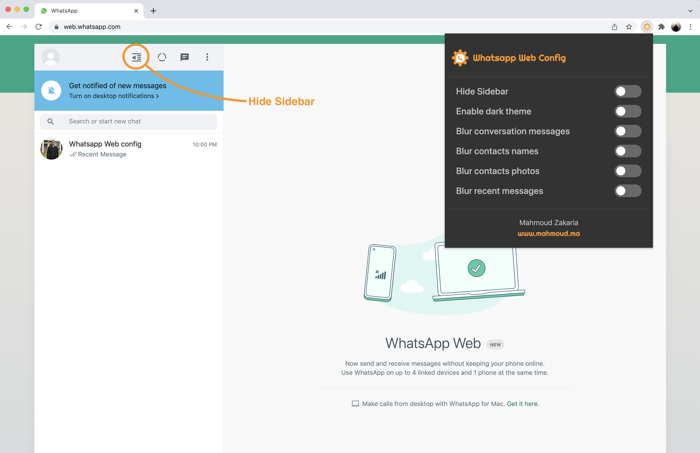
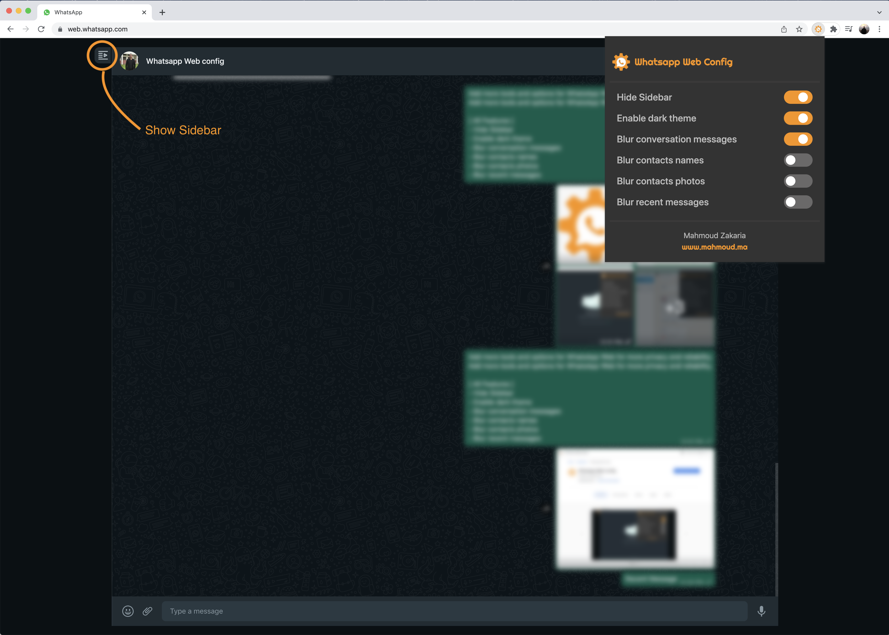
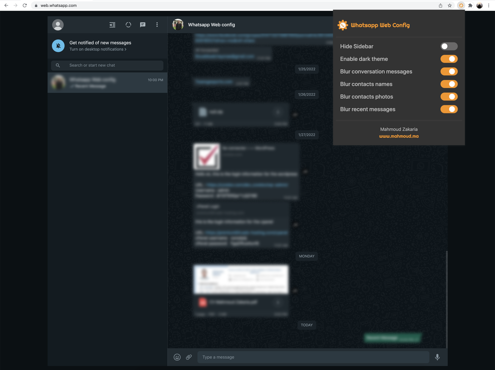

# Whatsapp Web Config 

*Add more tools and options for WhatsApp Web for more privacy and reliability.*
### Install 
- **Chrome Web Store:**  **[Whatsapp Web Config](https://chrome.google.com/webstore/detail/whatsapp-web-config/jnehogdihfnbcndmjobpoabnfblebkih/)**
### All Features 

* **Hide Sidebar**
* **Enable dark theme**
* **Blur conversation messages**
* **Blur contacts names**
* **Blur contacts photos**
* **Blur recent messages**
* **Blur range**

### Youtube Video
- [Whatsapp Web Config (Chrome extension)](https://youtu.be/E-rtPGpbKZo)

### ScreenShoot

### **Created by**

* 🇲🇦 **Mahmoud Zakaria** 
* 🌐 [www.mahmoud.ma](https://www.mahmoud.ma/)
